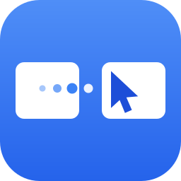

<p align="center">
  
</p>

<h1 align="center">EasySwitch</h1>

<p align="center">
  <b>One mouse and keyboard for all your computers.</b><br>
  Slide your cursor off the edge of one screen onto the next machine —
  macOS, Windows and Linux, over your local network.
</p>

<p align="center">
  <a href="https://easyswitch.realbrain.cc/download">Download</a> ·
  <a href="https://easyswitch.realbrain.cc">Website</a> ·
  <a href="https://github.com/developersharif/easyswitch-app/issues/new/choose">Report a bug</a> ·
  <a href="https://github.com/developersharif/easyswitch-app/discussions">Discussions</a>
</p>

> **This repository is the public home of EasySwitch** — bug reports,
> feature requests, discussions and release downloads. The application
> source is developed in a private repository; the release pipeline in
> this repo builds and publishes the official binaries.

## What it does

EasySwitch is a **software KVM** (in the spirit of Synergy, Barrier and
Deskflow): you keep one keyboard and mouse, and use them across every
computer on your desk.

- **Edge crossing** — move the cursor off a screen edge and it appears
  on the neighbouring machine; keyboard input follows it.
- **Hotkey switching** — `Ctrl+Alt+1…9` jumps straight to a machine,
  `Ctrl+Alt+L` locks input to the current one, double-tap `Ctrl` brings
  control home.
- **Shared clipboard** — copy text, images, files and folders on one
  computer, paste them on another. File transfers start only when you
  actually paste — copying alone never moves data over the network.
- **Web bridge** — send files and text to a machine from any device's
  browser (including your phone), with resumable large-file uploads.
- **Windows elevated surfaces** — an optional helper service lets your
  remote mouse and keyboard operate Task Manager, admin apps and even
  UAC prompts.
- **Auto-update, tray icon, keep-awake** while a session is active.

## Private by design

- **LAN only.** Your input and clipboard travel directly between your
  machines on your network — no cloud relay, no account required to run.
- **Encrypted.** Every connection uses the Noise protocol; nothing
  crosses the wire in plaintext.
- **Not remote desktop.** Only input events, clipboard data and device
  info are transmitted — never your screen.

Native Rust with a Slint UI: a single small binary, low idle memory,
instant startup.

## Install

**macOS / Linux** (one command — verifies the SHA-256 before installing):

```bash
curl -fsSL https://easyswitch.realbrain.cc/install.sh | sh
```

**Windows:** download the installer from the
[download page](https://easyswitch.realbrain.cc/download).

All builds are also attached to this repo's
[Releases](https://github.com/developersharif/easyswitch-app/releases).
macOS builds are Developer ID-signed and notarized.

**Platforms:** macOS (Apple Silicon + Intel, universal binary),
Windows 10/11, Linux (X11 and Wayland; input injection uses `uinput` —
the in-app Setup view shows the one-time commands).

## Reporting a bug

Please [open an issue](https://github.com/developersharif/easyswitch-app/issues/new/choose)
and include:

- the **OS + version of both machines** involved,
- the **EasySwitch version and build** from each machine's About card
  (e.g. `v0.1.0 (b106)`),
- what you did, what you expected, and what happened instead.

Feature ideas are welcome as
[feature requests](https://github.com/developersharif/easyswitch-app/issues/new/choose)
or in [Discussions](https://github.com/developersharif/easyswitch-app/discussions).

## FAQ

**Is this remote desktop / screen sharing?**
No. EasySwitch never transmits video. It shares your mouse, keyboard
and clipboard between machines that are physically in front of you.

**Does it need the internet?**
No — machines discover and talk to each other on your local network.

**Is it free?**
There's a free tier; paid plans unlock more computers and
larger clipboard file transfers. See
[pricing](https://easyswitch.realbrain.cc/pricing).

**Where is the source code?**
EasySwitch is a commercial product; the source lives in a private
repository. This public repo hosts issues, discussions, the release
pipeline and the published binaries.
